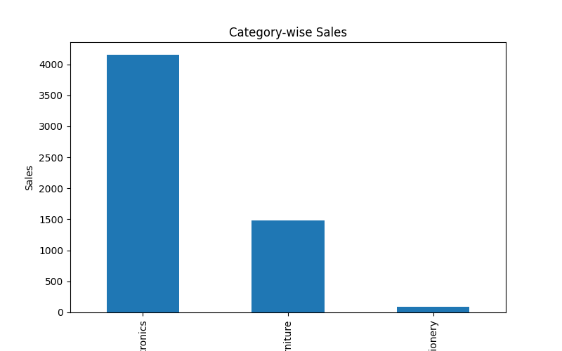
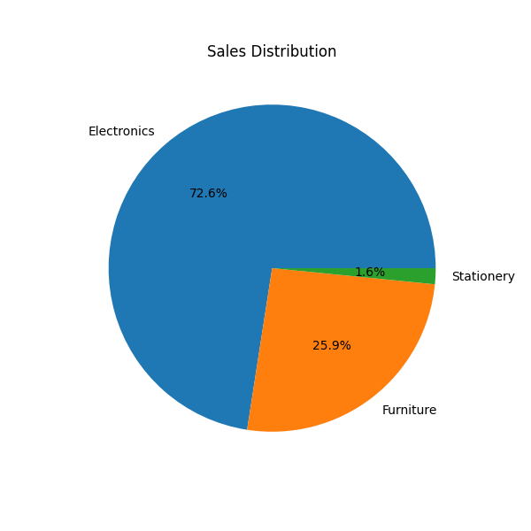

# 📊 Sales Data Analytics Project


## 📑 Table of Contents

- [Project Overview](#project-overview)
- [Features](#-features)
- [Technologies Used](#️-technologies-used)
- [Project Structure](#-project-structure)
- [Installation](#️-installation)
- [How to Run](#️-how-to-run)
- [Generated Visualizations](#-generated-visualizations)
- [Project Workflow](#-project-workflow)
- [Results & Insights](#-results--insights)
- [Learning Outcomes](#-learning-outcomes)
- [Acknowledgements](#-acknowledgements)
- [Future Improvements](#-future-improvements)
- [Author](#-author)

---

## 📌 Project Overview

A Python-based Sales Data Analytics project that transforms raw sales data into meaningful business insights using **Pandas**, **Matplotlib**, and an interactive **Streamlit Dashboard**.

The project analyzes sales records, calculates key performance metrics, generates visual reports, and exports the processed data to Excel. It demonstrates practical data analysis, visualization, and dashboard development using Python.

---

## ✨ Features

- 📂 Read and process sales data from a CSV file
- 📊 Perform sales data analysis using Pandas
- 📈 Visualize sales trends with bar and pie charts
- 🏆 Identify top-performing products
- 📋 Generate a structured Excel sales report
- 🎛️ Interactive dashboard built with Streamlit
- 🔍 Search and filter sales data
- 📅 Display real-time date and time
- 🌙 Light and Dark theme support

---

## 🛠️ Technologies Used

| Technology | Purpose |
|------------|---------|
| Python | Core programming language used for the project |
| Pandas | Data cleaning, processing, and analysis |
| Matplotlib | Creating bar and pie chart visualizations |
| Streamlit | Building the interactive dashboard |
| OpenPyXL | Exporting data to an Excel report |
| CSV | Source format for the sales dataset |
| Excel (.xlsx) | Generated sales report |

---

## 📂 Project Structure

```text
Sales_Data_Analytics_Project/
│
├── analysis.py          # Performs sales data analysis and generates insights
├── dashboard.py         # Interactive Streamlit dashboard
├── sales_data.csv       # Input sales dataset
├── sales_report.xlsx    # Generated Excel report
├── bar_chart.png        # Bar chart visualization
├── pie_chart.png        # Pie chart visualization
├── logo.png             # Project logo
├── requirements.txt     # Project dependencies
└── README.md            # Project documentation
```

---

## ⚙️ Installation

### 1. Clone the repository

```bash
git clone https://github.com/codebyahmadd/sales-data-analytics-project.git
```

### 2. Navigate to the project directory

```bash
cd sales-data-analytics-project
```

### 3. Install the required dependencies

```bash
pip install -r requirements.txt
```

---

## ▶️ How to Run

Run the analysis script:

```bash
python analysis.py
```

Launch the Streamlit dashboard:

```bash
streamlit run dashboard.py
```

After launching the dashboard, open the local URL displayed in your terminal (usually `http://localhost:8501`) in your web browser.

---

## 📈 Generated Visualizations

### 📊 Sales Bar Chart



### 🥧 Sales Distribution Chart



---

## 🔄 Project Workflow

1. Load the sales dataset from the CSV file.
2. Clean and process the data using Pandas.
3. Perform sales analysis and calculate key metrics.
4. Generate bar and pie chart visualizations.
5. Export the processed data to an Excel report.
6. Display the results through the Streamlit dashboard.

---

## 📊 Results & Insights

This project transforms raw sales data into meaningful business insights through analysis, visualization, and reporting. It helps identify top-performing products, category-wise sales distribution, and overall sales trends. The generated charts and interactive dashboard make the data easier to understand and support better decision-making.

---

## 🎯 Learning Outcomes

This project helped me strengthen my understanding of:

- Data analysis using Pandas
- Data visualization with Matplotlib
- Interactive dashboard development using Streamlit
- Working with CSV and Excel files
- Organizing a Python project professionally
- Writing clean and maintainable code

---

## 🙏 Acknowledgements

This project was developed as a practical learning experience to enhance my skills in Python, data analysis, data visualization, and dashboard development. It reflects my continuous effort to improve my problem-solving abilities and build real-world projects.

---

## 🚀 Future Improvements

- Add advanced filtering options.
- Support multiple dataset uploads.
- Include interactive charts using Plotly.
- Add user authentication.
- Integrate a database for persistent data storage.


---

## 👨‍💻 Author

**Ahmad Yar Daha**

- GitHub: [@codebyahmadd](https://github.com/codebyahmadd)
- LinkedIn: [Ahmad Yar Daha](https://www.linkedin.com/in/ahmad-yar-daha-6753bb423/)

If you found this project helpful, consider giving it a ⭐ on GitHub.